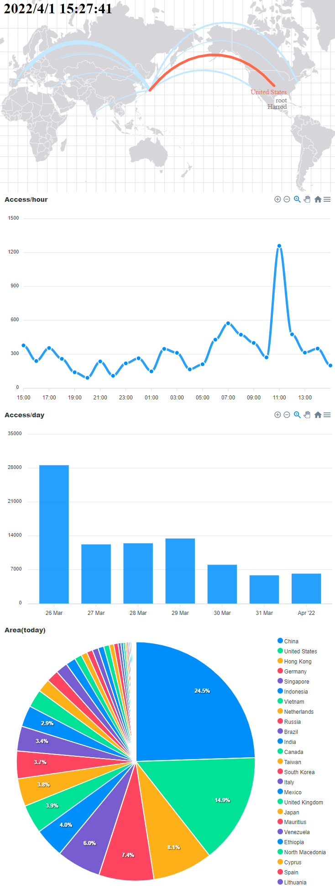
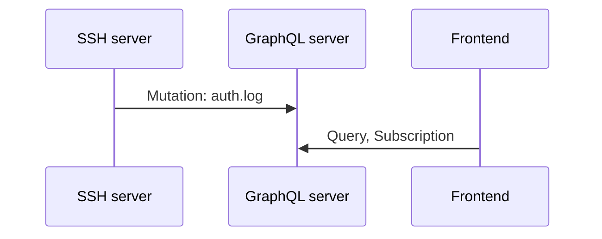

# graphql-ssh

SSH ログ収集と取り出し API を提供する graphql サーバ + それを利用したフロント




## ディレクトリ構造

```bash
.
｜# GraphQL サーバ本体
├── graphql-server/
｜# GraphQL サーバからのレスポンスを描画するフロント
├── frontend/
｜# GraphQL サーバ で利用する DB の Dockerfile とダミーデータ生成用スクリプト
├── mongodb/
｜# ssh のログファイルを監視して GraphQL サーバへ送信するツールとログファイルにダミーデータを挿入するスクリプト
├── tools/log2mutaion/
├── README.md
├── screenshot.png
└── docker-compose.yml
```

## 開発/デモ環境

```bash
docker-compose up -d
```

4 つのコンテナが起動します

- frontend : フロント [http://localhost:3000](http://localhost:3000)
- graphql-server : GraphQL サーバ [http://localhost:4000](http://localhost:4000)
- mongodb : DB サーバ(ダミーデータを格納)
- dummy-ssh-server : ssh ログ(ダミー)の送信元
