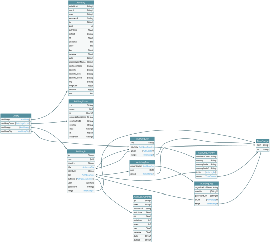
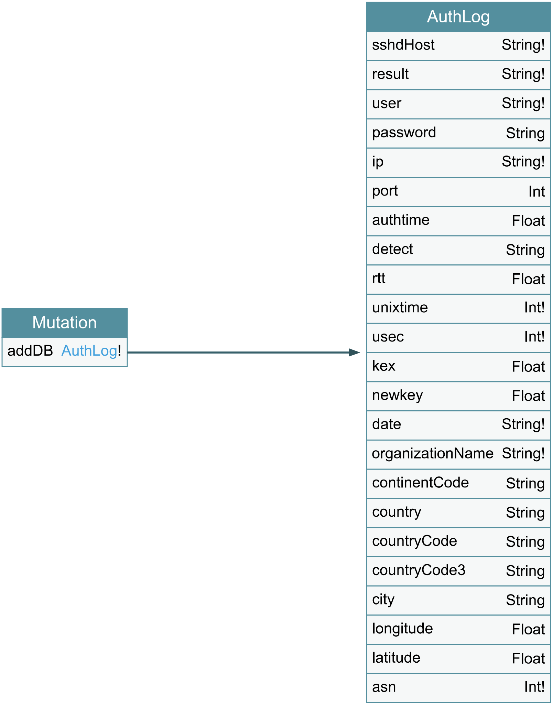
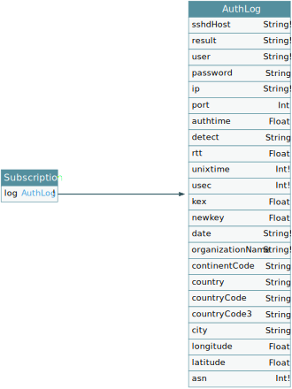

# graphql-ssh/graphql-server

## エンドポイント

[/graphql](http://localhost:4000/graphql) : GraphQL エンドポイント

[/playground](http://localhost:4000/playground) : GraphQL Playground

[/voyager](http://localhost:4000/voyager) : GraphQL Voyager

## スキーマ

Query スキーマの全体像


Mutation スキーマの全体像


Subcription スキーマの全体像

スキーマは `./schema` 以下に分割して定義、各スキーマと対応するリゾルバは `./resolver` 以下

## 環境変数

```env
DB # mongodbのurl
PORT # ポート番号
DENY_WRITE_TO_DB # trueの場合Mutationを禁止
```
